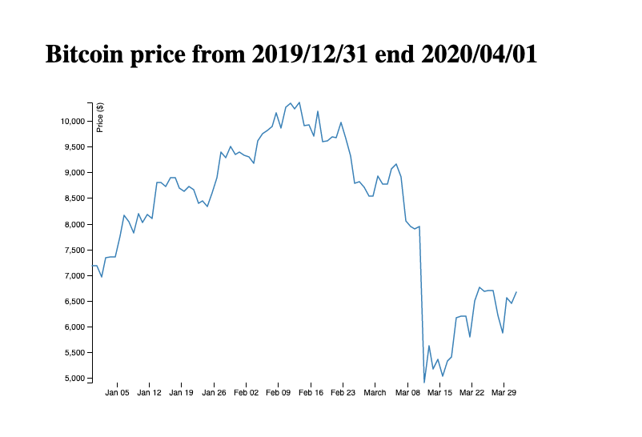

## Line Chart Bitcoin price from 2019/12/31 end 2020/04/01
If you are planning to create custom visualizations on the web like my bitcoin price project, chances are that you have already thought about using visual representations of your data (D3.js). A web-based visualization library that features a plethora of APIs to handle the heavy lifting of creating advanced, dynamic, and beautiful visualization content on the web.



#### sample code

```
	let x = d3.scaleTime().rangeRound([0, width]);

	let y = d3.scaleLinear().rangeRound([height, 0]);

```
* Create scales for our line chart. Since we'll be displaying the pricing of Bitcoin over the period of the past few months. To display the time duration on the x axis. D3 provides as a function of a scale time to create such kind of scales.

* y-axis to keep the scale linear since we are just showing the price of bitcoin on that axis.


```
	let line = d3.line()
		.x((d) => x(d.date))
		.y((d) => y(d.value));
	    x.domain(d3.extent(data, (d) => d.date));
	    y.domain(d3.extent(data, (d) => d.value));

```
* d3.line(): This function returns another function which creates the line.
* .domain(): Is designed to let D3 know about the scope of the data when it is passed to scale function.
* .x() method takes an anonymous function which gets pass the data.
* x.domain():using extend a method to let D3 know about the scope of the data.
* .extend() : method takes an anonymous function which returns data value and in the end it returns minimum and maximum value of the dates.
* y.domain() : method in which it returns the minimum and maximum value.
  

```
g.append('g')
		.attr('transform', 'translate(0,' + height + ')')
		.call(d3.axisBottom(x))
		.select('.domain')
		.remove();
```

* Within append a group element inside our parent group and apply some transformations to it.
* Then we pass d3.axisBottom() function to .call() method.
* When we are using the call function over here we are actually calling d3.axisBottom() on our newly created group element.
* We then select any classes of domain and remove it.


```
	g.append('g')
		.call(d3.axisLeft(y))
		.append('text')
		.attr('fill', '#000')
		.attr('transform', 'rotate(-90)')
		.attr('y', 6)
		.attr('dy', '0.71em')
		.attr('text-anchor', 'end')
		.text('Price ($)');

```
* This block of code would basically generate the y axis.
* In the end we append a path inside our parent group element.This path would be the line which we see in the line chart.


### Additional Resources
1. <a href="https://www.coindesk.com/coindesk-api" target="_blank">Coindesk Bitcoin Price API</a>
2. <a href="https://www.freecodecamp.org/news/learn-d3-js-in-5-minutes-c5ec29fb0725/" target="_blank">FreeCodeCamp Learn D3.js in 5 minutes</a>
